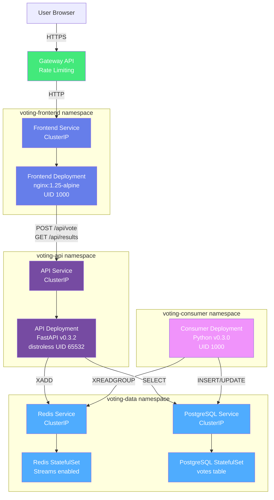

# Voting Website: Cats vs Dogs


Event-driven voting application deployed on Kubernetes with real-time results.

## Overview

A microservices-based voting platform where users vote between two options (Cats vs Dogs). Votes are processed through an event-driven architecture using Redis Streams, with results stored in PostgreSQL and displayed in real-time.

## Tech Stack

- **Frontend:** React 18, TypeScript, Vite, Nginx v0.5.0 - Phase 3 ✓
- **API:** FastAPI v0.3.2 (Python) - Phase 2 ✓
- **Event Consumer:** Python v0.3.0 (K8s Deployment) - Phase 2 ✓
- **Data Store:** PostgreSQL 15
- **Event Stream:** Redis Streams 7
- **Deployment:** Kubernetes, Helm
- **Containerization:** Docker (multistage builds, distroless, non-root)

## UI Preview

**[View Interactive Mockup](frontend/mockup.html)** - Open in browser to see the voting interface

**Features:**
- Side-by-side voting buttons (Cats vs Dogs)
- Real-time results with progress bars
- Responsive design (mobile stacks vertically)
- Full accessibility (ARIA, keyboard navigation)

> **Note:** The mockup is a fully interactive HTML page demonstrating the UI without backend dependencies

## Architecture

### Kubernetes Infrastructure



### Event Flow


**Key Design Decisions:**
1. **4-namespace isolation:** Security boundaries between layers (ADR-0004)
2. **Redis Streams:** Event log with consumer groups (ADR-0002)
3. **Non-root containers:** All services run as unprivileged users
4. **Gateway API:** Rate limiting and ingress (ADR-0005)
5. **Consumer as Deployment:** Continuous processing, not batch Job

## Quick Start

### Prerequisites
- Kubernetes cluster (minikube/kind for local)
- Helm 3+
- kubectl

### Installation

**Quick Start (Minikube):**
```bash
# Automated deployment script
./scripts/deploy-local.sh --rebuild

# Or manual steps:
# 1. Start Minikube
minikube start --cpus=4 --memory=8192

# 2. Build images in Minikube
eval $(minikube docker-env)
docker build -t frontend:0.5.0 frontend/
docker build -t api:0.3.2 api/
docker build -t consumer:0.3.0 consumer/

# 3. Deploy with Helm
helm install voting-app ./helm -f helm/values-local.yaml

# 4. Access application
kubectl port-forward -n voting-frontend svc/frontend 8080:80
# Visit http://localhost:8080
```

**See [DEPLOYMENT.md](docs/DEPLOYMENT.md) for complete guide.**

### Development

**TDD Required:** Test-Driven Development is mandatory for all new features.

See documentation:
- [CONTRIBUTING.md](CONTRIBUTING.md) - Conventional Commits, TDD workflow
- [TESTING.md](docs/TESTING.md) - Testing guide, coverage requirements
- [CONVENTIONS.md](docs/CONVENTIONS.md) - Code standards, atomic principles

**Run tests:**
```bash
# Unit tests (Docker)
./scripts/run-unit-tests.sh [frontend|api|consumer|all]

# Integration tests (Minikube + Helm)
./scripts/run-integration-tests.sh
```

## Project Status

**Current Version:** 0.5.0

**Completed Phases:**
- ✅ **Phase 0:** Project documentation and architecture
- ✅ **Phase 1:** Kubernetes infrastructure (namespaces, deployments, StatefulSets, Ingress)
- ✅ **Phase 2:** Backend core (FastAPI + Consumer implementation)
- ✅ **Phase 3:** Frontend implementation (VoteButtons, VoteResults, API integration)
- ✅ **Phase 3.5:** Testing & Validation (Vitest, 100% component coverage, TDD established)

**Next Phases:**
- **Phase 4:** Security & Hardening (network policies, container scanning, input validation)
- **Phase 5:** Integration testing (full stack deployment, end-to-end flows)
- **Phase 6:** Documentation and production readiness

**Component Versions:**
- API: v0.3.2 (FastAPI, security hardened, Redis + PostgreSQL)
- Consumer: v0.3.0 (Redis Streams processor, asyncpg)
- Frontend: v0.5.0 (React 18, TypeScript, custom hooks, API integration)

## Documentation

**Development:**
- [CONTRIBUTING.md](CONTRIBUTING.md) - TDD workflow, conventional commits, PR process
- [TESTING.md](docs/TESTING.md) - Testing guide, TDD examples, coverage requirements
- [CONVENTIONS.md](docs/CONVENTIONS.md) - Code standards, atomic principles, security practices
- [DEPLOYMENT.md](docs/DEPLOYMENT.md) - Minikube setup, Helm deployment, troubleshooting

**Architecture:**
- [Architecture Decision Records](docs/adr/) - Key architectural decisions (5 ADRs)
- [Issues & Solutions](docs/issues/) - Problems encountered and solutions

**Validation:**
- [Phase 1 Validation](docs/PHASE1_VALIDATION.md) - Infrastructure validation protocol
- [Phase 2 Validation](docs/PHASE2_VALIDATION.md) - Backend validation protocol
- [Phase 3 Validation](docs/PHASE3_VALIDATION.md) - Frontend validation protocol

**History:**
- [Session Logs](docs/sessions/) - Development session history (12 sessions)
- [Changelog](CHANGELOG.md) - Version history

## Resuming Work

**For developers using AI assistants:**

See [Handoff Guide](docs/HANDOFF_GUIDE.md) for how to efficiently resume work.

**Quick start:**
```
Last session: @docs/sessions/[latest-session].md
Current todos: @todos.md
```

## Versioning

This project follows [Semantic Versioning](https://semver.org/):
- **MAJOR:** Incompatible API changes
- **MINOR:** Backwards-compatible functionality
- **PATCH:** Backwards-compatible bug fixes

## License

MIT
