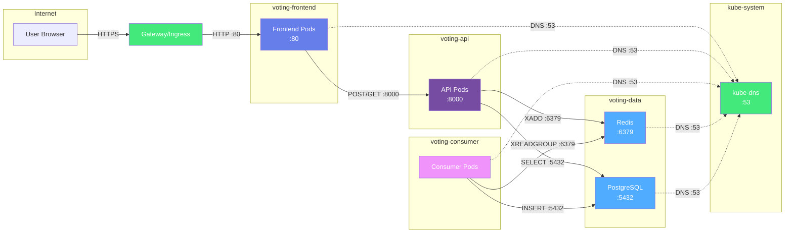

# Kubernetes Network Policy Documentation

**Purpose:** Define least-privilege network isolation for all microservices using Kubernetes NetworkPolicy

**Status:** Infrastructure Complete - Testing Pending (Phase 4.5)
**Last Updated:** 2025-11-18

---

## Executive Summary

This document defines network security policies for the voting application's 4-namespace architecture. Policies implement **default deny-all with explicit allow** to enforce least-privilege network access.

**Security Model:**
- Default deny all ingress traffic to all namespaces
- Explicit allow rules for documented traffic flows only
- DNS resolution allowed for all pods (kube-dns access)
- No egress restrictions (allows internet access if needed)

---

## Architecture Overview

### Namespace Structure

| Namespace | Components | Purpose |
|-----------|-----------|---------|
| `voting-frontend` | Nginx (React app) | Serves static frontend |
| `voting-api` | FastAPI | Handles vote submission and results |
| `voting-consumer` | Python consumer | Processes Redis Stream events |
| `voting-data` | PostgreSQL, Redis | Data persistence and event streaming |

### Network Segmentation Strategy

**Layer-based isolation (ADR-0004):**
1. **Presentation Layer** (`voting-frontend`) - Publicly accessible via Gateway
2. **Application Layer** (`voting-api`, `voting-consumer`) - Internal only
3. **Data Layer** (`voting-data`) - Strictest isolation, no direct external access

---

## Traffic Flow Analysis

### Legitimate Traffic Matrix

| Source Namespace | Source Component | Destination Namespace | Destination Component | Port | Protocol | Purpose |
|-----------------|------------------|----------------------|----------------------|------|----------|---------|
| `istio-system` or `ingress-nginx` | Gateway/Ingress | `voting-frontend` | Frontend Service | 80 | TCP | Serve frontend to users |
| `voting-frontend` | Frontend Pods | `voting-api` | API Service | 8000 | TCP | POST /api/vote, GET /api/results |
| `voting-api` | API Pods | `voting-data` | Redis Service | 6379 | TCP | XADD votes to stream |
| `voting-api` | API Pods | `voting-data` | PostgreSQL Service | 5432 | TCP | SELECT vote results |
| `voting-consumer` | Consumer Pods | `voting-data` | Redis Service | 6379 | TCP | XREADGROUP from stream |
| `voting-consumer` | Consumer Pods | `voting-data` | PostgreSQL Service | 5432 | TCP | INSERT/UPDATE votes |
| All namespaces | All Pods | `kube-system` | kube-dns | 53 | UDP | DNS resolution |

**Total allowed flows:** 7 distinct traffic patterns

### Traffic Flow Diagram



### Blocked Traffic (Security Boundaries)

| Blocked Flow | Reason |
|--------------|--------|
| Frontend → PostgreSQL | Frontend should never access database directly |
| Frontend → Redis | Frontend should never access event stream directly |
| Consumer → Frontend | Consumer has no need to access presentation layer |
| Consumer → API | Consumer processes independently, no API access needed |
| External → API (direct) | All traffic must go through Gateway |
| External → Data layer (direct) | Database/Redis must never be publicly accessible |

---

## Policy Design Decisions

### 1. Default Deny Strategy

**Decision:** Implement default deny-all ingress for all namespaces

**Rationale:**
- Least-privilege principle: traffic explicitly allowed only
- Fail-secure: new deployments blocked until policy updated
- Reduces attack surface significantly

**Implementation:**
```yaml
# Default deny all ingress to namespace
apiVersion: networking.k8s.io/v1
kind: NetworkPolicy
metadata:
  name: default-deny-ingress
spec:
  podSelector: {}  # Applies to all pods in namespace
  policyTypes:
  - Ingress
  # No ingress rules = deny all
```

### 2. DNS Resolution Access

**Decision:** Allow all pods to reach kube-dns in kube-system namespace

**Rationale:**
- DNS is required for Service discovery
- Blocking DNS breaks Kubernetes networking entirely
- Low security risk (DNS is read-only service lookup)

**Port:** 53/UDP (DNS queries), 53/TCP (zone transfers, large responses)

### 3. Egress Policy

**Decision:** No egress restrictions in initial implementation

**Rationale:**
- Egress control adds significant complexity
- Application doesn't make external API calls currently
- Can add egress policies in Phase 6 if needed

**Future consideration:** Restrict egress to only internal services + kube-dns

### 4. Pod Selector Strategy

**Decision:** Use app label selectors, not namespace selectors alone

**Rationale:**
- More granular control (pod-level vs namespace-level)
- Allows multiple apps in same namespace if needed
- Follows Kubernetes best practices

**Label convention:**
- `app.kubernetes.io/name: voting-app`
- `app.kubernetes.io/component: [frontend|api|consumer|postgres|redis]`

---

## Network Policy Specifications

### Policy 1: Default Deny All (4 namespaces)

**File:** `helm/templates/network-policies/default-deny.yaml`

**Applies to:** All 4 namespaces

**Effect:** Block all ingress traffic by default

**Implementation:**
```yaml
{{- range $ns := list "voting-frontend" "voting-api" "voting-consumer" "voting-data" }}
---
apiVersion: networking.k8s.io/v1
kind: NetworkPolicy
metadata:
  name: default-deny-ingress
  namespace: {{ $ns }}
spec:
  podSelector: {}
  policyTypes:
  - Ingress
{{- end }}
```

---

### Policy 2: Frontend Ingress from Gateway

**File:** `helm/templates/network-policies/frontend-ingress.yaml`

**Source:** Gateway/Ingress controller (istio-system or ingress-nginx namespace)
**Destination:** Frontend pods in voting-frontend namespace
**Port:** 80 (HTTP)

**Selectors:**
- Source: `namespaceSelector: name: istio-system` OR `ingress-nginx`
- Destination: `app.kubernetes.io/component: frontend`

**Implementation:**
```yaml
apiVersion: networking.k8s.io/v1
kind: NetworkPolicy
metadata:
  name: frontend-allow-ingress
  namespace: voting-frontend
spec:
  podSelector:
    matchLabels:
      app.kubernetes.io/component: frontend
  policyTypes:
  - Ingress
  ingress:
  - from:
    # Allow from Istio gateway
    - namespaceSelector:
        matchLabels:
          name: istio-system
    # OR allow from nginx ingress
    - namespaceSelector:
        matchLabels:
          name: ingress-nginx
    ports:
    - protocol: TCP
      port: 80
```

**Note:** Adjust namespace label based on actual Gateway deployment

---

### Policy 3: API Ingress from Frontend

**File:** `helm/templates/network-policies/api-allow-frontend.yaml`

**Source:** Frontend pods in voting-frontend namespace
**Destination:** API pods in voting-api namespace
**Port:** 8000 (FastAPI)

**Selectors:**
- Source: `namespaceSelector: voting-frontend` + `podSelector: frontend`
- Destination: `app.kubernetes.io/component: api`

**Implementation:**
```yaml
apiVersion: networking.k8s.io/v1
kind: NetworkPolicy
metadata:
  name: api-allow-frontend
  namespace: voting-api
spec:
  podSelector:
    matchLabels:
      app.kubernetes.io/component: api
  policyTypes:
  - Ingress
  ingress:
  - from:
    - namespaceSelector:
        matchLabels:
          name: voting-frontend
      podSelector:
        matchLabels:
          app.kubernetes.io/component: frontend
    ports:
    - protocol: TCP
      port: 8000
```

---

### Policy 4: PostgreSQL Ingress from API and Consumer

**File:** `helm/templates/network-policies/postgres-allow.yaml`

**Source:** API pods (voting-api) + Consumer pods (voting-consumer)
**Destination:** PostgreSQL pods in voting-data namespace
**Port:** 5432 (PostgreSQL)

**Selectors:**
- Source: API OR Consumer (multiple from clauses)
- Destination: `app.kubernetes.io/component: postgres`

**Implementation:**
```yaml
apiVersion: networking.k8s.io/v1
kind: NetworkPolicy
metadata:
  name: postgres-allow-api-consumer
  namespace: voting-data
spec:
  podSelector:
    matchLabels:
      app.kubernetes.io/component: postgres
  policyTypes:
  - Ingress
  ingress:
  - from:
    # Allow from API namespace
    - namespaceSelector:
        matchLabels:
          name: voting-api
      podSelector:
        matchLabels:
          app.kubernetes.io/component: api
    # Allow from Consumer namespace
    - namespaceSelector:
        matchLabels:
          name: voting-consumer
      podSelector:
        matchLabels:
          app.kubernetes.io/component: consumer
    ports:
    - protocol: TCP
      port: 5432
```

---

### Policy 5: Redis Ingress from API and Consumer

**File:** `helm/templates/network-policies/redis-allow.yaml`

**Source:** API pods (voting-api) + Consumer pods (voting-consumer)
**Destination:** Redis pods in voting-data namespace
**Port:** 6379 (Redis)

**Selectors:**
- Source: API OR Consumer (multiple from clauses)
- Destination: `app.kubernetes.io/component: redis`

**Implementation:**
```yaml
apiVersion: networking.k8s.io/v1
kind: NetworkPolicy
metadata:
  name: redis-allow-api-consumer
  namespace: voting-data
spec:
  podSelector:
    matchLabels:
      app.kubernetes.io/component: redis
  policyTypes:
  - Ingress
  ingress:
  - from:
    # Allow from API namespace
    - namespaceSelector:
        matchLabels:
          name: voting-api
      podSelector:
        matchLabels:
          app.kubernetes.io/component: api
    # Allow from Consumer namespace
    - namespaceSelector:
        matchLabels:
          name: voting-consumer
      podSelector:
        matchLabels:
          app.kubernetes.io/component: consumer
    ports:
    - protocol: TCP
      port: 6379
```

---

### Policy 6: DNS Access for All Pods

**File:** `helm/templates/network-policies/allow-dns.yaml`

**Source:** All pods in all namespaces
**Destination:** kube-dns in kube-system namespace
**Port:** 53 (DNS)

**Implementation:**
```yaml
{{- range $ns := list "voting-frontend" "voting-api" "voting-consumer" "voting-data" }}
---
apiVersion: networking.k8s.io/v1
kind: NetworkPolicy
metadata:
  name: allow-dns-access
  namespace: {{ $ns }}
spec:
  podSelector: {}
  policyTypes:
  - Egress
  egress:
  - to:
    - namespaceSelector:
        matchLabels:
          name: kube-system
      podSelector:
        matchLabels:
          k8s-app: kube-dns
    ports:
    - protocol: UDP
      port: 53
    - protocol: TCP
      port: 53
{{- end }}
```

**Note:** This is an egress policy (outbound from pods to DNS)

---

## CNI Compatibility

### Supported CNIs

Kubernetes NetworkPolicy is supported by these CNI plugins:

| CNI Plugin | NetworkPolicy Support | Notes |
|------------|---------------------|-------|
| **Calico** | ✅ Full support | Recommended, extended CRDs available |
| **Cilium** | ✅ Full support | Advanced L7 policies, Hubble observability |
| **Weave Net** | ✅ Full support | Simple setup, good for dev |
| **Antrea** | ✅ Full support | VMware-backed, enterprise features |
| **Flannel** | ❌ No support | Does NOT support NetworkPolicy alone |
| **Flannel + Calico** | ✅ Full support | Flannel for routing + Calico for policy |
| **Kube-router** | ✅ Full support | Lightweight option |

### Current CNI: Calico v3.27.0

**Status:** ✅ Installed and verified (2025-11-17)

**Pods running:**
```
calico-node-b5vnf                1/1     Running
calico-kube-controllers          1/1     Running
```

### Verification Command

Check CNI deployment:
```bash
# List CNI pods in kube-system
kubectl get pods -n kube-system | grep -E 'calico|cilium|weave'

# Check for Calico
kubectl get pods -n kube-system -l k8s-app=calico-node

# Check for Cilium
kubectl get pods -n kube-system -l k8s-app=cilium

# Verify NetworkPolicy API
kubectl api-resources | grep networkpolicies
```

**Expected output (Calico installed):**
```
calico-kube-controllers-xxx   1/1     Running
calico-node-xxx                1/1     Running
networkpolicies    netpol    networking.k8s.io/v1    true    NetworkPolicy
```

### Minikube CNI

Default Minikube does NOT support NetworkPolicy. Enable with:
```bash
# Start Minikube with Calico CNI
minikube start --network-plugin=cni --cni=calico

# Verify Calico installation
kubectl get pods -n kube-system | grep calico
```

### Future: Cilium Migration

**See:** [docs/tech-to-review.md](tech-to-review.md) for Cilium evaluation

**Advantages of Cilium:**
- eBPF-based (superior performance)
- Hubble UI (visual network observability)
- L7 NetworkPolicy (HTTP method/path filtering)
- Service mesh without sidecars

**Migration timeline:** Post-Phase 6 (after NetworkPolicy validation with Calico)

---

## Testing & Validation

### Pre-Deployment Validation

Before applying policies to production:

1. **Verify CNI support** (see CNI Compatibility section)
2. **Label audit**: Ensure all pods have correct `app.kubernetes.io/component` labels
3. **Deploy to dev cluster first** (minikube or separate namespace)
4. **Test allowed connections** (should succeed)
5. **Test denied connections** (should fail)

### Connectivity Test Matrix

| Test | Expected Result | Command |
|------|----------------|---------|
| Frontend → API | ✅ Success | `kubectl exec -n voting-frontend frontend-pod -- curl api.voting-api:8000/health` |
| API → PostgreSQL | ✅ Success | `kubectl exec -n voting-api api-pod -- nc -zv postgres.voting-data 5432` |
| API → Redis | ✅ Success | `kubectl exec -n voting-api api-pod -- nc -zv redis.voting-data 6379` |
| Consumer → PostgreSQL | ✅ Success | `kubectl exec -n voting-consumer consumer-pod -- nc -zv postgres.voting-data 5432` |
| Consumer → Redis | ✅ Success | `kubectl exec -n voting-consumer consumer-pod -- nc -zv redis.voting-data 6379` |
| Frontend → PostgreSQL | ❌ Denied | `kubectl exec -n voting-frontend frontend-pod -- nc -zv postgres.voting-data 5432` (should timeout) |
| Frontend → Redis | ❌ Denied | `kubectl exec -n voting-frontend frontend-pod -- nc -zv redis.voting-data 6379` (should timeout) |
| All pods → kube-dns | ✅ Success | `kubectl exec -n voting-api api-pod -- nslookup kubernetes.default` |

### Integration Test

Run full application test after policy deployment:
```bash
# Deploy policies
helm upgrade voting-app ./helm --set networkPolicies.enabled=true

# Wait for policies to apply
sleep 5

# Run integration tests
./scripts/run-integration-tests.sh

# Expected: All tests pass, no 503 errors
# If tests fail: policies too restrictive, need debugging
```

---

## Troubleshooting

### Common Issues

#### Issue 1: Pods can't resolve DNS

**Symptom:** Pods show `temporary failure in name resolution`

**Cause:** DNS egress policy missing or incorrect

**Fix:**
```bash
# Verify kube-dns labels
kubectl get pods -n kube-system -l k8s-app=kube-dns --show-labels

# Verify DNS policy exists
kubectl get networkpolicy -n voting-api allow-dns-access -o yaml

# Test DNS from pod
kubectl exec -n voting-api api-pod -- nslookup kubernetes.default
```

#### Issue 2: Frontend can't reach API (503 errors)

**Symptom:** POST /api/vote returns 503 Service Unavailable

**Cause:** NetworkPolicy blocking frontend→API traffic

**Debug:**
```bash
# Check if API policy exists
kubectl get networkpolicy -n voting-api api-allow-frontend -o yaml

# Verify frontend pod labels
kubectl get pods -n voting-frontend -o wide --show-labels

# Check if namespace has correct label
kubectl get namespace voting-frontend --show-labels

# Test connection from frontend pod
kubectl exec -n voting-frontend frontend-pod -- curl -v http://api.voting-api:8000/health
```

**Common fixes:**
- Namespace label mismatch (voting-frontend vs name: voting-frontend)
- Pod selector label mismatch
- Port number incorrect (8000 vs 80)

#### Issue 3: Consumer can't connect to PostgreSQL

**Symptom:** Consumer logs show "connection refused" or timeout to PostgreSQL

**Cause:** NetworkPolicy blocking consumer→PostgreSQL traffic

**Debug:**
```bash
# Check PostgreSQL policy
kubectl get networkpolicy -n voting-data postgres-allow-api-consumer -o yaml

# Verify consumer pod labels
kubectl get pods -n voting-consumer --show-labels

# Test PostgreSQL connectivity
kubectl exec -n voting-consumer consumer-pod -- nc -zv postgres.voting-data 5432
```

#### Issue 4: All ingress blocked after default deny

**Symptom:** Everything broken after deploying default-deny policy

**Cause:** Default deny deployed before allow policies

**Fix:**
```bash
# Deploy allow policies first, then default deny
# OR delete default deny temporarily
kubectl delete networkpolicy -n voting-api default-deny-ingress

# Deploy allow policies
kubectl apply -f helm/templates/network-policies/

# Re-apply default deny last
kubectl apply -f helm/templates/network-policies/default-deny.yaml
```

**Best practice:** Use Helm to deploy all policies atomically

### Debugging Commands

```bash
# List all NetworkPolicies in namespace
kubectl get networkpolicy -n voting-api

# Describe specific policy (shows selectors, rules)
kubectl describe networkpolicy -n voting-api api-allow-frontend

# View policy YAML
kubectl get networkpolicy -n voting-api api-allow-frontend -o yaml

# Test connectivity from pod
kubectl exec -n voting-frontend frontend-pod -- curl -v http://api.voting-api:8000/health

# Use netcat for port testing
kubectl exec -n voting-api api-pod -- nc -zv postgres.voting-data 5432

# Check pod labels (crucial for selectors)
kubectl get pods -n voting-api --show-labels

# Check namespace labels
kubectl get namespaces --show-labels

# Cilium-specific: View policy enforcement
cilium endpoint list
cilium policy get

# Calico-specific: View effective policies
calicoctl get networkpolicy --all-namespaces
```

---

## Deployment Strategy

### Phase 1: Dev/Local Testing (Safe)

1. Deploy to minikube with Calico CNI
2. Apply all policies via Helm
3. Run integration tests
4. Fix any connectivity issues
5. Document working configuration

### Phase 2: Staging (Validation)

1. Deploy to staging cluster
2. Enable policies with `networkPolicies.enabled=true` in values
3. Monitor application logs for connection errors
4. Run load tests to verify performance impact
5. Validate monitoring/alerting works

### Phase 3: Production (Gradual Rollout)

**Option A - Audit Mode (Cilium only):**
1. Deploy policies in audit mode (log violations, don't block)
2. Monitor logs for 24-48 hours
3. Fix any unexpected traffic patterns
4. Switch to enforcement mode

**Option B - Gradual Namespace Rollout:**
1. Enable policies for `voting-data` namespace first (lowest risk)
2. Wait 24 hours, monitor
3. Enable for `voting-consumer` namespace
4. Wait 24 hours, monitor
5. Enable for `voting-api` namespace
6. Wait 24 hours, monitor
7. Enable for `voting-frontend` namespace last

**Recommended:** Option B for production safety

### Rollback Plan

If policies break production:
```bash
# Emergency rollback: disable all NetworkPolicies
helm upgrade voting-app ./helm --set networkPolicies.enabled=false

# OR delete specific problematic policy
kubectl delete networkpolicy -n voting-api api-allow-frontend

# Verify application recovers
curl https://voting-app.example.com/health
```

---

## Helm Integration

### Values Configuration

Add to `helm/values.yaml`:
```yaml
networkPolicies:
  enabled: false  # Default disabled for safety

  # CNI-specific settings
  cni: calico  # Options: calico, cilium, weave

  # Policy customization
  defaultDeny: true
  allowDNS: true
  allowEgress: true  # No egress restrictions initially
```

### Template Structure

```
helm/templates/network-policies/
├── default-deny.yaml          # Default deny all ingress
├── frontend-ingress.yaml      # Gateway → Frontend
├── api-allow-frontend.yaml    # Frontend → API
├── postgres-allow.yaml        # API + Consumer → PostgreSQL
├── redis-allow.yaml           # API + Consumer → Redis
└── allow-dns.yaml             # All → kube-dns
```

### Conditional Deployment

Wrap all NetworkPolicy templates:
```yaml
{{- if .Values.networkPolicies.enabled }}
apiVersion: networking.k8s.io/v1
kind: NetworkPolicy
...
{{- end }}
```

---

## Security Considerations

### What NetworkPolicies Protect Against

✅ **Prevents:**
- Lateral movement between compromised pods
- Direct database access from untrusted components
- Unauthorized service-to-service communication
- External access to internal services (Redis, PostgreSQL)

### What NetworkPolicies Do NOT Protect Against

❌ **Does not prevent:**
- Application-level vulnerabilities (SQL injection, XSS)
- Container escape (use securityContext, AppArmor, SELinux)
- Privilege escalation (use Pod Security Standards)
- Malicious code in trusted pods (use image scanning)
- DDoS attacks (use rate limiting, WAF)
- Data exfiltration via allowed connections (use egress policies, DLP)

### Defense in Depth

NetworkPolicies are ONE layer in a comprehensive security strategy:

1. **Network Layer** (this document): NetworkPolicy
2. **Application Layer**: Input validation, authentication, authorization
3. **Container Layer**: Non-root users, read-only filesystems, no capabilities
4. **Pod Layer**: Pod Security Standards (restricted)
5. **Image Layer**: Vulnerability scanning, signed images
6. **Cluster Layer**: RBAC, admission controllers (OPA/Kyverno)
7. **Infrastructure Layer**: Cloud provider security groups, firewalls

---

## References

- **Kubernetes NetworkPolicy Documentation**: https://kubernetes.io/docs/concepts/services-networking/network-policies/
- **Calico NetworkPolicy Guide**: https://docs.tigera.io/calico/latest/network-policy/
- **Cilium NetworkPolicy**: https://docs.cilium.io/en/stable/security/policy/
- **NetworkPolicy Editor (Visual Tool)**: https://editor.networkpolicy.io/
- **ADR-0004**: Layer-based namespace security architecture (docs/adr/0004-namespace-security.md)

---

**Implementation Status:**
1. ✅ CNI installed and verified (Calico v3.27.0)
2. ✅ Policy YAML files created in helm/templates/network-policies/ (6 files, 12 policies total)
3. ✅ Namespace labels added for NetworkPolicy selectors
4. ✅ Helm values configuration added (networkPolicies.enabled: false by default)
5. ⏳ Pending: Deploy to dev/local cluster (requires Phase 5 application deployment)
6. ⏳ Pending: Run integration tests to validate application functionality
7. ⏳ Pending: Deploy to staging with gradual rollout
8. ⏳ Pending: Production rollout
